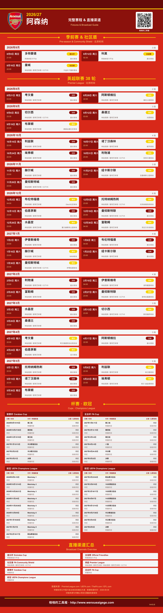
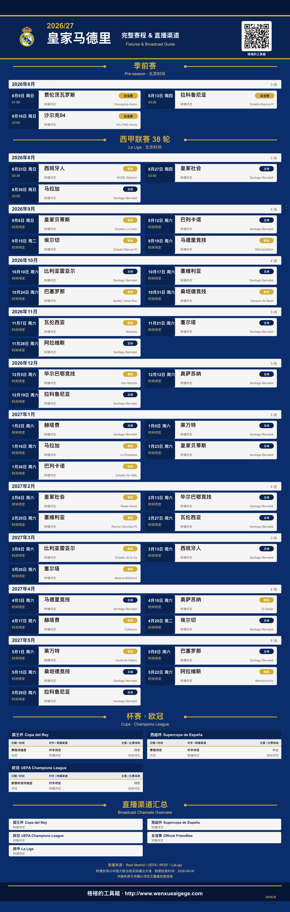
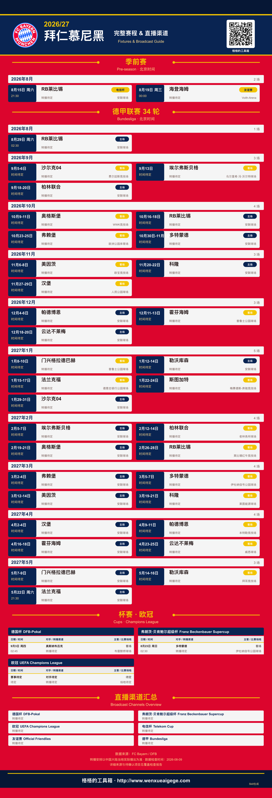

# aigegebox-football-match-guide

> 格格的工具箱公开 Skill：把球队赛程整理成中国大陆球迷看得懂、找得到、可以保存的赛季看球指南。

**English summary:** An agent skill for organizing a men's first-team football season schedule, verifying mainland-China broadcast information, and rendering a team-branded fixture poster with a coverage report.

## 它解决什么问题

一支球队的联赛、国内杯赛、欧战、超级杯和友谊赛往往分散在不同来源，转播渠道也不统一。这个 Skill 会根据球队、赛季和地区，整理可确认的比赛，标注赛事分类、比赛时间、场地、主客场和中国大陆转播信息，并生成适合保存和分享的完整赛季长图。

它的重点不是用 AI 生成一张“看起来像赛程”的图片，而是：

> 先核对数据，再用确定性的 SVG/HTML 模板排版。

## 快速使用

安装后，在支持 Agent Skills 的智能体中输入：

```text
$aigegebox-football-match-guide
请生成阿森纳 2026/27 赛季中国大陆看球指南。
以当前日期为查询基准，保留所有未结束比赛；
没有官方确认的数据标记为待定，不要猜测。
```

也可以替换为其他球队，例如皇家马德里、拜仁慕尼黑或北京国安。

## 安装

通过 Codex Skill Installer 安装：

```bash
python3 ~/.codex/skills/.system/skill-installer/scripts/install-skill-from-github.py \
  --url https://github.com/wenxueaigege/aigegebox-football-match-guide-skill/tree/main/skills/football-match-guide
```

安装后重新打开 Codex 会话，再使用 `$aigegebox-football-match-guide` 调用。

## 默认范围

- 默认地区：中国大陆（`CN-mainland`）。
- 默认对象：男子成年一线队。
- 默认覆盖：联赛、国内杯赛、联赛杯、洲际赛事、超级杯、世俱杯、资格赛、附加赛和官方友谊赛。
- 默认只展示查询基准日之后尚未结束的比赛；原始数据和覆盖报告仍保留完整历史记录。
- 女子队、预备队和青年队不会混入结果，除非用户明确指定。

## 数据与准确性规则

- 赛程优先使用俱乐部、联赛、杯赛或赛事组织方的官方来源。
- 中国大陆转播优先使用版权平台、央视及相关频道的官方节目安排。
- 未确认的对手、日期、时间、场地或转播渠道显示为“待定”，不凭常识补全。
- 每场转播信息保留来源、状态和更新时间；没有可靠来源时显示“转播待定”。
- 用户提供的海报或对话记录可以作为辅助参考，但不会冒充官方来源。
- 生成结果会附带赛事覆盖检查、待确认项目和最后检查时间。

## 队徽规则

- 队徽库已有经过核验的官方资源时直接复用。
- 队徽库没有资源时，必须从对应俱乐部官网获取，并登记资源来源页面。
- 不使用搜索引擎缩略图、第三方球队资料站、AI 重绘或文字盾牌作为正式队徽。
- 队徽保持原始宽高比，不拉伸变形；公开或商业传播前请自行确认商标使用许可。

## 输出内容

通常会生成：

- 完整赛季看球长图：SVG 矢量母版。
- HTML 预览版：方便在浏览器检查和保存。
- 4 倍高清 PNG：用于手机保存、打印或分享。
- 覆盖检查报告：已发现赛事、待覆盖赛事、转播确认数和待定项目。

本项目已取消独立分享卡片输出，避免维护两套重复的视觉结果。

## 示例入口

当前公开包中的结构化示例：

| 球队 | 示例状态 | 文件 |
| --- | --- | --- |
| 阿森纳 | 已有完整赛程示例和海报预览 | [`JSON`](skills/football-match-guide/examples/arsenal-2026-27-real-2026-08-09.json) · [`海报预览`](skills/football-match-guide/examples/posters/arsenal-2026-27/poster-preview.png) |
| 皇家马德里 | 已有赛程示例和海报预览 | [`JSON`](skills/football-match-guide/examples/real-madrid-2026-27-2026-08-08.json) · [`海报预览`](skills/football-match-guide/examples/posters/real-madrid-2026-27/poster-preview.png) |
| 拜仁慕尼黑 | 官方当前快照和海报预览 | [`JSON`](skills/football-match-guide/examples/bayern-munich-2026-27-2026-08-09.json) · [`海报预览`](skills/football-match-guide/examples/posters/bayern-munich-2026-27/poster-preview.png) |

示例海报使用同一套确定性排版脚本生成；阿森纳和皇马复用已经验证过的输出，拜仁用于验证德甲、德国杯和超级杯等赛事配置。未公布的欧冠赛程和中国大陆转播信息会明确显示“待定”。

### 海报预览

<table>
  <tr>
    <td align="center"><br>阿森纳</td>
    <td align="center"><br>皇家马德里</td>
    <td align="center"><br>拜仁慕尼黑</td>
  </tr>
</table>

每个预览目录同时保留 `season-poster.svg`、`season-poster.html`、4 倍 PNG 的渲染清单和覆盖报告，方便查看代码之外的实际成品。

## 目录结构

实际 Skill 位于 `skills/football-match-guide/`：

- `SKILL.md`：触发条件、工作流程和失败处理。
- `scripts/`：规范化、校验、覆盖检查和海报渲染脚本。
- `references/`：赛程、转播、队徽、校验和排版规则。
- `teams/`：球队名称、颜色、队徽和赛事配置。
- `examples/`：结构化赛程输入示例。
- `assets/`：官方队徽和确定性排版资源。

## 当前限制

- 不做后台实时同步；再次生成时才重新检查来源。
- 转播安排可能临时调整，海报底部仍以“中国大陆当地实际播出安排”为准。
- 不做 OCR，不承诺扫描版文件或复杂外部数据的自动恢复。
- 不包含服务器部署、API Key、付费体育数据接口或自动支付功能。

## 反馈与来源标记

欢迎通过 GitHub Issues 反馈数据遗漏、排版问题或新的球队需求。生成海报时，二维码目标和底部网址可以由使用者自己指定：`--qr-url` 控制二维码实际打开的完整链接，`--footer-url` 控制海报底部显示的网址，`--footer-label` 控制署名。未指定时默认使用格格工具箱主页；明确不需要二维码时使用 `--no-qr`。默认主页二维码继续使用 `from=football-match-guide` 来源参数，以兼容已有访问统计和历史链接。

仓库地址：<https://github.com/wenxueaigege/aigegebox-football-match-guide-skill>
